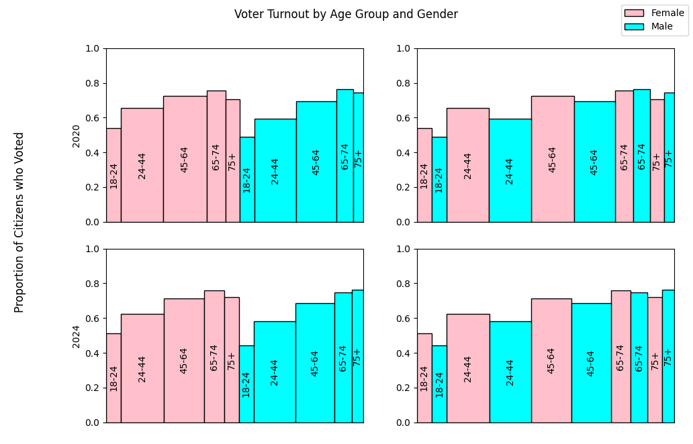

Plot generated from sample.py: 

Bar widths denote proportion of total citizen population  
Data from: 
https://www.census.gov/data/tables/time-series/demo/voting-and-registration/p20-585.html 
https://www.census.gov/data/tables/time-series/demo/voting-and-registration/p20-587.html
 (Tabel 2 All Races)
